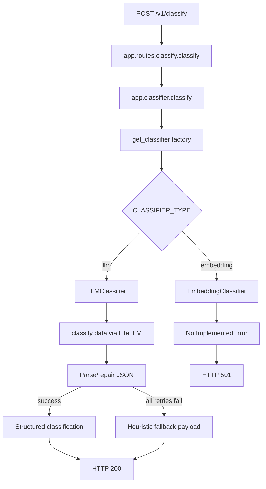

# Classifier Implementation Guide

This document explains how classification is implemented in this service, from request entry to final response.

## High-level flow



## App startup and configuration

At startup, `app/main.py`:

1. Loads environment variables from `.env` using `python-dotenv`.
2. Runs `Config.validate()` to fail fast on invalid configuration.
3. Creates the FastAPI app and mounts routers under `/v1`.

Configuration comes from `app/config.py`.

### Important environment variables

Required for LLM mode:

- `LLM_API_KEY`

Primary optional settings:

- `CLASSIFIER_TYPE` (`llm` or `embedding`; default `llm`)
- `LLM_MODEL` (default `gpt-4-turbo`)
- `LLM_TEMPERATURE` (default `0.0`)
- `LLM_MAX_TOKENS` (default `4000`)
- `LLM_BASE_URL` (custom OpenAI-compatible endpoint)
- `LLM_PROVIDER` (provider hint, default `openai`)
- `LLM_FALLBACK_MODEL` (secondary model tried if primary model fails)
- `LLM_DEBUG_CAPTURE` (`true/false`, writes parse-failure payloads)
- `LLM_DEBUG_DIR` (directory for debug payloads, default `.llm_debug`)

## Classifier factory and lifecycle

`app/classifier.py` is the classifier factory facade.

- `get_classifier()` caches one classifier instance globally.
- It tracks the current `CLASSIFIER_TYPE` and recreates the instance when the type changes.
- `_create_classifier()` dispatches:
  - `llm` -> `LLMClassifier`
  - `embedding` -> `EmbeddingClassifier`
  - unknown type -> `ValueError`
- `reset_classifier_cache()` exists mainly for tests.

This keeps runtime lookup simple while avoiding repeated classifier construction per request.

## Route behavior and HTTP mapping

`POST /v1/classify` in `app/routes/classify.py`:

1. Accepts JSON body `{ "data": "..." }`.
2. Calls the factory facade `app.classifier.classify(data)`.
3. Normalizes the returned payload into:
   - `classification`
   - `method`
   - optional `error`

Exception mapping:

- `ValueError` -> `400`
- `NotImplementedError` -> `501`
- `RuntimeError` -> `500`
- Any other `Exception` -> `500`

## LLM classifier internals

`app/classifiers/llm.py` implements `LLMClassifier`.

### Initialization

During `__init__`:

- Reads model and generation config from `Config`.
- Requires `LLM_API_KEY`.
- Sets `litellm.api_key` and optional `litellm.api_base`.
- Loads system prompt text via `load_prompt("classifier")` from `app/prompts/classifier.md`.

### Classification strategy

`classify(data)` calls `_classify_with_fallback(data)` and then annotates `method`.

Fallback attempt matrix:

1. Primary model with full prompt
2. Primary model with compact instruction
3. Primary model with minimal schema prompt
4. If configured, repeat 1-3 on `LLM_FALLBACK_MODEL`

If all attempts fail to produce usable JSON, classifier returns a deterministic low-confidence fallback payload rather than throwing parse errors.

### Response extraction and JSON repair

The classifier supports multiple provider response shapes and applies layered JSON recovery:

1. Extract text from `choices[0].message.content` or alternative content fields.
2. Parse raw response.
3. Parse extracted JSON candidate (strip markdown code fences and surrounding text).
4. Repair common JSON issues:
   - trailing commas
   - missing commas between adjacent values
5. Detect truncation and salvage by closing open strings/containers.
6. As a final repair step, ask the model to rewrite malformed JSON strictly.
7. Optional debug capture writes raw failures and parse metadata to disk.

If still not parseable, the strategy records failures and eventually returns heuristic fallback output.

## Heuristic fallback payload

When model output is empty/invalid across strategies, `_build_graceful_fallback()` returns:

- `classification` object with required sections populated conservatively
- `content_outline` summary
- `classification_notes` with ambiguity and confidence context
- top-level `error`
- `fallback_source: "heuristic"`

Heuristics are keyword-based and intentionally low confidence.

## Embedding classifier status

`app/classifiers/embedding.py` currently raises `NotImplementedError` in both constructor and `classify()`.

Operational consequence:

- `CLASSIFIER_TYPE=embedding` initializes into a not-implemented path.
- API returns HTTP `501` for classify requests in embedding mode.

## Prompt loading

`app/prompts/__init__.py` loads prompt markdown by name from the prompts directory.

- `load_prompt("classifier")` reads `app/prompts/classifier.md`.
- Missing prompt file raises `FileNotFoundError`, wrapped as `RuntimeError` by `LLMClassifier` init.

## Test coverage highlights

Tests in `tests/` verify:

- config validation and defaults
- factory/classifier behavior
- classify endpoint status mappings
- LLM JSON extraction/repair and fallback behavior
- custom endpoint settings and fallback model usage

Run tests with:

```bash
uv run pytest -q
```
